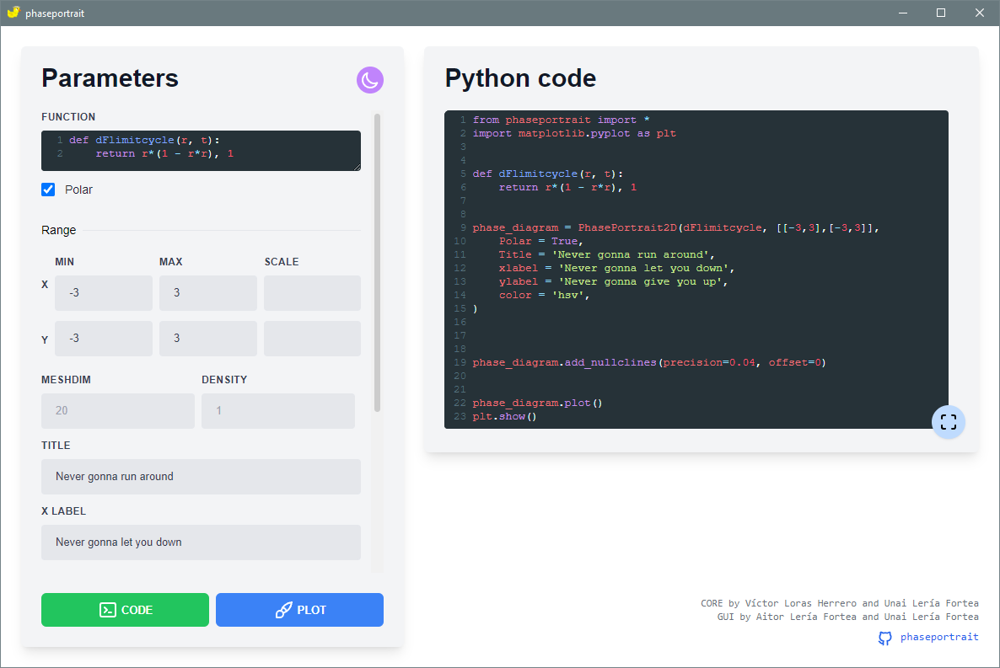

# PhasePortrait-GUI

PhasePortrait-GUI is a Graphical User Interface of our library [PhasePortrait](https://github.com/phaseportrait/phaseportrait). Only 2D and 3D phase diagrams at supported at the moment, with no plans of adding additional features.

Its intention is to provide access for beginners in Python or in our library to this resource. But also allowing to get the Python equivalent code for futher and more complex uses.


# Example of use

Let's see the phase portrait of the following differential equations:


Where r and t are polar coordinates: radius and angle respectively.


We can add to the plot a **colorbar** that indicates the speed's modulus.

We can also add **nullclines** (isoclines) that show where vx = 0 (red) and  vy = 0 (green).


Finally, if you need the Python code in order to recreate the plot you can press the green `code` button:




# Requirements
In order to generate the plots and the Python code it is **necessary** that Python can be accessed via terminal with:
```
$ python
```
And [PhasePortrait](https://github.com/phaseportrait/phaseportrait) must me installed in that Python. You can install it with
```
$ pytohn -m pip install phaseportrait
```
This will install all necesary dependencies required.


# Installation
Go to the [releases page](https://github.com/phaseportrait/phaseportrait-gui/releases) and download the aplication matching your computer architecture. When downloaded unzip the file.

If there is not a matching file you can [build](#how-to-build) it yourself.

# Documentation
Please visit the   [main documentation page](https://phaseportrait.github.io/) for more information.

Also, we encourage you to let us know any bugs, malfunctions, improvements or even feedback if you are a marvelous person.


# How to build
This is only necesary if the computer architecture is not already in the [releases page](https://github.com/phaseportrait/phaseportrait-gui/releases).


To build for the current machine you can build the aplication with
```
$ npm install
$ npm run build
```
The program will be located at `./dist/`.
